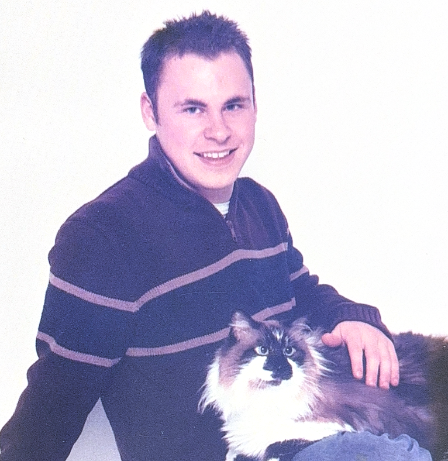

# **About Me – Ryan Grigg**

I am an IT Specialist and Network Engineer with over nine years of experience supporting, securing, and administering complex IT systems across federal, military, and private‑sector environments. My career has been shaped by a blend of military discipline, hands‑on technical expertise, and a commitment to building reliable, secure, and user‑focused infrastructure.

My professional journey began in the 148th Air National Guard, where I served as a Network Systems Operations Specialist (Technical Sergeant, E‑6) and later as an IT Specialist (GS‑11). During this time, I managed more than 80 network devices, automated switch configurations, maintained NIST‑aligned security controls, and provided Tier 1 and Tier 2 support for over 1,200 users. I also designed a remote imaging server that was adopted Air Force‑wide — one of the accomplishments I’m most proud of.

Today, I work as a Systems Administrator at US Trade Logistics, where I continue to build and support critical infrastructure. I’ve developed an internal CRM system, deployed Azure Exchange and Microsoft 365, and improved operational workflows through automation and thoughtful system design.

---

## **Academic Background**

I am currently completing my A.A.S. in Cybersecurity and Network Engineering at Lake Superior College (expected August 2026). My coursework spans:

- Cisco networking  
- Windows and Linux system administration  
- Security fundamentals  
- IDS/IPS  
- Ethical hacking  
- Cloud computing  
- Forensics and incident response  
- Virtualization and server technologies  

This program has strengthened my foundation in both networking and cybersecurity, preparing me for roles that require a deep understanding of secure system design, troubleshooting, and infrastructure management.

---

## **Professional Strengths**

I thrive in environments where reliability, security, and clarity matter. My strengths include:

- System administration (Windows and Linux/UNIX)  
- Network engineering and device configuration  
- Cybersecurity fundamentals, IDS/IPS, and ethical hacking  
- Virtualization and cloud services  
- Active Directory and enterprise management  
- Troubleshooting and diagnostics  
- Technical documentation and process improvement  
- Customer‑focused IT support  
- Leadership, communication, and mentoring  

I enjoy solving complex problems, designing maintainable systems, and creating documentation that empowers others.

---

## **Project Work and Technical Interests**

I’m passionate about hands‑on projects that combine hardware, software, and security. My capstone project — a Smart Pet Water Fountain Prototype — brings together microcontroller programming, automation logic, web infrastructure, and optional IoT control. It reflects my interest in embedded systems, secure web design, and real‑world problem solving.

Other projects include:

- Deploying OpenProject via Docker and evaluating its performance  
- Designing a remote imaging server used across the Air Force  
- Building internal business systems such as CRM platforms  
- Implementing secure cloud‑based communication and collaboration tools  

I enjoy exploring new technologies, especially in cybersecurity, automation, and infrastructure engineering.

---

## **Professional Goals**

My long‑term goals include advancing into senior systems administration, cybersecurity engineering, or infrastructure automation roles. I’m driven by the challenge of designing secure, scalable, and resilient systems — and by the opportunity to support organizations through thoughtful, well‑engineered solutions.

---

## **Contact**

- Email: **pro.ryangrigg@gmail.com**  
- Location: **Duluth, MN**  
- GitHub: **[https://github.com/pro-ryangrigg/portfolio](https://github.com/pro-ryangrigg/portfolio)**  
- LinkedIn: *(Coming soon)*  

Just tell me the style you want.
